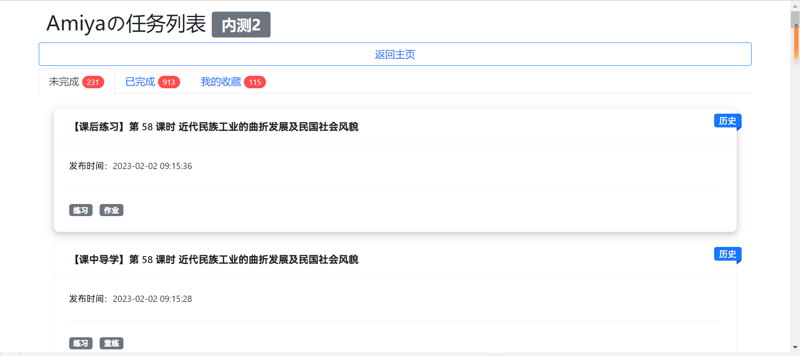

<h2 align="center" style="font-weight: 600">zyzx-第三方网页版</h2>
<p align="center">
    <s>更方便的</s>第三方zyzx任务界面
    <br />
    Version: 2.0.1.202309091746
    <!-- <a href="https://music.qier222.com" target="blank"><strong>🌎 访问DEMO</strong></a>  |  
    <a href="#%EF%B8%8F-安装" target="blank"><strong>📦️ 下载安装包</strong></a>  |  
    <a href="https://t.me/yesplaymusic" target="blank"><strong>💬 加入交流群</strong></a>
    <br />
    <br /> -->
  </p>
</p>

## ✨ 特性

- ✅ 使用 Vue3 开发 在线使用无需下载
- 📃 可以查看自己的任务完全数量
- 🧩 基本完美复刻原版功能（除了跨域的部分）
- 💾 支持某些奇妙功能
- 📱 可以避免拿着硕大的设备完成任务
- 📻 支持所有能跑现代浏览器的设备（用老人机都能完成任务）
- ✔️ 支持自定义用户 根页面带上token(必带)和name(可选)参数访问即可
- 🖥️ 支持 PWA，可在 Chrome/Edge 里点击地址栏右边的 ➕ 安装到电脑

## 🛠️ 开发&打包

- 安装项目依赖

```shell
npm install
```

## 💻 开发

- 运行本项目

```shell
npm run dev
```

## 📦️ 打包

- 直接 git clone 然后[安装依赖](#️-开发打包)打包即可

```shell
npm run build
```

## ☑️ Todo

1. 现在是所有的数据都获取到本地了才开始渲染数据（比较蠢
2. 也许在遥远的未来会支持跨域的部分 <s>前提是我有自己的服务器</s>

欢迎提 Issue 和 Pull request。

## 📜 开源许可

本项目仅供个人学习研究使用，禁止用于商业及非法用途。

基于 [GNU GPL v3](https://www.gnu.org/licenses/gpl-3.0.en.html#license-text) 许可进行开源。

## 🖼️ 截图

